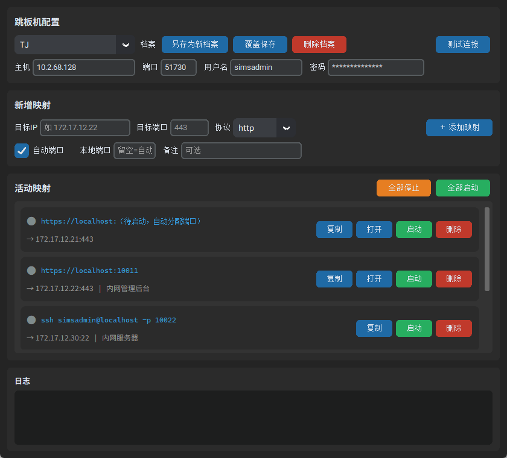

# JumpTunnel — SSH Port Forwarding Tool

English | **[中文](./README.md)**

> A GUI tool that maps internal-network server ports to your local machine through an SSH jump host — so you can reach them straight from your browser or terminal. Think of it as managing several `ssh -N -L ...` commands at once, but with no commands to memorize, no passwords to type, and a clean visual interface.



---

## What does this tool do?

In many companies, servers live on an internal network (e.g. `172.17.x.x`) that your laptop can't reach directly. You first SSH into a **jump host** (bastion), and from there access the internal machines.

The classic way is to open a terminal and type:

```bash
ssh -N -L 10011:172.17.12.22:443 tj
```

This means: through jump host `tj`, map the internal `172.17.12.22:443` to your local port `10011`. Then visiting `https://localhost:10011` in a browser is the same as reaching that internal machine.

**The problem**: the command is hard to remember, you can only run one per terminal, you have to type the password every time, ports collide, and you end up with a pile of terminal windows you can't tell apart.

**This tool automates all of that**: fill in a few fields, click a button, and manage many mappings at once.

---

## Who is it for?

- **Ops / backend developers** who routinely access internal web consoles, databases, caches, and SSH terminals through a jump host.
- **QA / frontend developers** who want to open an internal test environment directly in their local browser for debugging.
- **Anyone who doesn't want to memorize SSH flags** like `-L` and `-N` — just click around a GUI.

---

## Key features

| Feature | Description |
|---------|-------------|
| 🔌 **One-click forwarding** | Fill in the jump host and target, click "Start" — password login is handled automatically, no commands needed. |
| 🔢 **Auto port allocation** | Let the OS pick a free local port (no conflicts), or specify one manually. |
| 🌐 **Web ports** (http/https) | Generates a clickable local URL — one click opens it in your browser. |
| 🖥️ **Non-web ports** (ssh/mysql/redis…) | Auto-generates the matching connection command (e.g. `ssh -p 10022 root@localhost`), copy it to your clipboard in one click. |
| 🧑‍💻 **Per-mapping login user** | Each mapping can specify its own login username (defaults to `root`), which is included in the generated SSH command. |
| 💾 **Jump-host profiles** | Save commonly used jump hosts as profiles and switch via dropdown — no re-typing. |
| 📋 **Multi-mapping management** | Each mapping starts/stops independently with a clear status light (🟢running / ⚪stopped / 🔴error); active mappings show which jump host they go through (`via user@host:port`). |
| 🔄 **Persistent config** | Restores your last jump host and mapping list after restarting. |

---

## Quick start

### Option 1: Use the prebuilt exe (easiest — nothing to install)

Get `JumpTunnel.exe` (or the NSIS installer `JumpTunnel_0.3.0_x64-setup.exe`) and **double-click to run**.

> First launch takes about 0.5 s — no extraction step.

### Option 2: Run in dev mode

Requires [Rust](https://rustup.rs/), [Node.js](https://nodejs.org/), and [cargo-tauri](https://tauri.app/start/prerequisites/).

```bash
cd src-tauri
cargo tauri dev
```

---

## How to use it

1. **Configure the jump host**
   In the top "Jump host" section, enter the host, port, username, and password.
   Click "Save as new profile" to store it — next time, switch with the dropdown.
   Not sure it connects? Hit "Test connection" first.

2. **Add a mapping**
   In "New mapping", fill in the target IP, target port (the protocol is auto-detected), and login username (defaults to `root`), then click "+ Add mapping".
   - Check "Auto port" to let the system pick a local port (recommended), or uncheck and specify one.
   - A note is optional but handy for telling machines apart.

3. **Start and use**
   In the "Active mappings" list, click "Start" on each row. Once the light turns green:
   - **Web protocol**: click the URL or the "Open" button — your browser opens the local address.
   - **tcp protocol** (ssh/mysql/redis…): click "Copy" to grab the connection command, then paste it into a terminal.

---

## Auto protocol detection

When you type a target port, the protocol is chosen automatically:

| Target port | Protocol chosen | What you get |
|-------------|----------------|--------------|
| 443 / 8443 | https | `https://localhost:<port>` (open in browser) |
| 80 / 8080 / 8000 | http | `http://localhost:<port>` (open in browser) |
| 22 | ssh | `ssh -p <port> root@localhost` (copy command) |
| 3306 | mysql | `mysql -h localhost -P <port> -u root -p` (copy command) |
| 6379 | redis | `redis-cli -h localhost -p <port>` (copy command) |
| 5432 | postgres | `psql -h localhost -p <port> -U postgres` (copy command) |
| other | tcp (generic) | `localhost:<port>` (copy connection string) |

> You can also change the protocol manually from the dropdown.

---

## Where is the config stored?

All configuration (jump-host profiles, mapping list) is saved locally:

- **Windows**: `%APPDATA%\com.jumptunnel.app\config.json`

> On first launch, config is imported automatically from the legacy path `~\.ssh_forward_tool\config.json` if it exists.

⚠️ **Security note**: the jump-host password is stored in **plaintext** in this file (so it can be auto-restored).
Make sure the file isn't readable by others. If you'd rather not store it, clear the `password` field manually — but you'll need to re-enter the password each launch.

---

## Build an exe (to distribute)

```bash
cd src-tauri
cargo tauri build
```

When done:

- **NSIS installer**: `src-tauri/target/release/bundle/nsis/JumpTunnel_0.3.0_x64-setup.exe` (~2 MB)
- **Portable exe**: `src-tauri/target/release/jumptunnel.exe` (~5 MB)

Copy it to anyone and they can double-click to run it — no runtime needed (Windows 10 1803+ / Windows 11 ship with WebView2).

---

## Project structure

```
src-tauri/               # Rust backend (Tauri 2)
├── src/
│   ├── main.rs          # entry point
│   ├── lib.rs           # app assembly: window, plugins, command registration, exit cleanup
│   ├── commands.rs      # all #[tauri::command] (IPC entry points)
│   ├── config.rs        # config read/write + legacy migration
│   ├── events.rs        # frontend event definitions
│   └── tunnel/
│       ├── mod.rs       # TunnelManager: tunnel state machine & lifecycle
│       └── forward.rs   # russh: connect, auth, local forwarding loop
├── tauri.conf.json      # window, icon, bundling config
├── capabilities/        # permission declarations
└── Cargo.toml

frontend/                # frontend (React 18 + TypeScript + Vite + Tailwind)
├── src/
│   ├── App.tsx          # main layout + event subscriptions
│   ├── components/      # JumphostPanel / MappingForm / MappingRow / LogPanel
│   ├── stores.ts        # zustand global state
│   ├── ipc.ts           # invoke wrappers & types
│   └── lib.ts           # protocol detection & connection command templates
└── package.json

dev-frontend.mjs         # cross-platform frontend dev server launcher
build-frontend.mjs       # cross-platform frontend build
docs/tauri-refactor-plan.md  # refactor plan
```

---

## FAQ

**Q: Tunnel fails with "Authentication failed"?**
A: Check the jump-host username and password — use "Test connection" to verify.

**Q: Local port is already in use?**
A: Check "Auto port" to let the system allocate one, or pick a free port number.

**Q: Tunnel is up but the target is unreachable?**
A: Make sure the target IP and port are actually reachable from the jump host (SSH in and ping/curl it).

**Q: It's a non-web port like SSH — how do I use it?**
A: Click "Copy" to get the connection command (e.g. `ssh -p 10022 root@localhost`), then paste it into a terminal.

---

## Technical notes

- **Backend**: Rust + [Tauri 2](https://tauri.app/). The SSH tunnel is implemented in-process with [russh](https://github.com/russh/russh) (pure Rust + tokio async) for password auth and port forwarding.
  Windows' built-in `ssh.exe` doesn't accept a plaintext password on the command line, so a library approach is used for reliable password auth.
- **Frontend**: React 18 + TypeScript + Vite + Tailwind CSS. Dark theme, modern card-style UI.
- **Architecture**: the Rust backend is the single source of truth. Each mapping runs in its own tokio task with a state machine (`Stopped → Connecting → Running → Error`); state changes and logs are pushed to the frontend via Tauri events, and the frontend only renders.
- **Auto port allocation** works by binding local port `0`, letting the OS assign a free port; the actual port is read back after the tunnel starts.
- **Single instance**: `tauri-plugin-single-instance` prevents double-launches from stealing ports.
- **Exit cleanup**: closing the main window stops all tunnels automatically.

---

English | **[中文](./README.md)**
