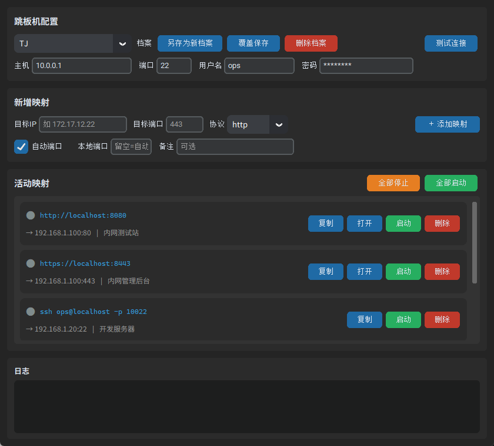

# JumpTunnel — SSH 端口转发工具

**[English](./README.en.md)** | 中文

> 一个带图形界面的本地端口转发工具：通过 SSH 跳板机，把内网里的服务器端口「搬」到你的电脑本地，用浏览器或命令行就能直接访问。等价于一次管理好几条 `ssh -N -L ...` 命令，但不用记命令、不用敲密码、可视化操作。



---

## 这工具是干嘛的？解决什么问题？

很多公司的服务器都在内网（比如 `172.17.x.x`），你的电脑没法直接连上，必须先 SSH 登录到一台「跳板机」，再从跳板机去访问内网。

传统做法是开一个终端敲命令：

```bash
ssh -N -L 10011:172.17.12.22:443 tj
```

这条命令的意思是：通过跳板机 `tj`，把内网的 `172.17.12.22:443` 映射到你本机的 `10011` 端口。之后浏览器访问 `https://localhost:10011` 就等于访问了内网那台机器。

**问题在于**：命令难记、一次只能开一条、密码要手动敲、端口容易冲突、开了一堆终端窗口不知道哪个是哪个。

**这个工具把上面这些全自动化了**：填几个框、点一下按钮就行，而且能同时管很多条映射。

---

## 适合什么人用？

- **运维 / 后端开发**：经常需要通过跳板机访问内网的 Web 管理后台、数据库、缓存、SSH 终端。
- **测试 / 前端开发**：想在本机直接打开内网的测试环境网页调试。
- **不想记 SSH 命令的人**：图形界面点点就行，不用背 `-L`、`-N` 这些参数。

---

## 核心功能

| 功能 | 说明 |
|------|------|
| 🔌 **一键建立转发** | 填好跳板机和目标，点「启动」即可，密码自动登录，无需手动输命令。 |
| 🔢 **自动分配端口** | 本地端口可以让系统自动分配（避免冲突），也可以手动指定。 |
| 🌐 **Web 端口**（http/https） | 映射后生成可点击的本地 URL，点一下就在浏览器打开。 |
| 🖥️ **非 Web 端口**（ssh/mysql/redis…） | 自动生成对应的连接命令（如 `ssh root@localhost -p 10022`），一键复制到剪贴板。 |
| 💾 **跳板机档案** | 把常用的跳板机存成档案，下拉框切换，不用每次重填。 |
| 📋 **多映射管理** | 每条映射独立启停，状态指示灯一目了然（🟢运行 / ⚪停止 / 🔴出错）。 |
| 🔄 **配置持久化** | 重启程序后自动恢复你上次的跳板机和映射列表。 |

---

## 快速开始

### 方式一：直接用打包好的 exe（最省事，无需装任何东西）

拿到 `JumpTunnel.exe`，**双击运行**即可。

> 首次启动会稍慢 1~2 秒（单文件 exe 需要解压），属正常现象。

### 方式二：用 uv 运行（推荐开发用）

先安装 [uv](https://docs.astral.sh/uv/)，然后：

```bash
uv sync          # 创建虚拟环境并安装依赖
uv run main.py   # 启动程序
```

### 方式三：用传统 pip

需要 Python 3.10+。

```bash
pip install -r requirements.txt
python main.py
```

也可以直接双击 `run.bat`（自动安装依赖并启动）。

---

## 使用步骤（图文版）

1. **配置跳板机**
   在顶部「跳板机配置」区填入主机、端口、用户名、密码。
   点「另存为新档案」可以存起来，下次用下拉框一键切换。
   不确定能不能连？先点「测试连接」验证一下。

2. **添加映射**
   在「新增映射」区填：目标 IP、目标端口（协议会自动推断），点「＋ 添加映射」。
   - 本地端口勾选「自动端口」由系统分配（推荐），或取消勾选后手动指定。
   - 备注可选，方便你区分这是哪台机器。

3. **启动并使用**
   在「活动映射」列表里，对每条点「启动」，状态灯变绿后：
   - **Web 协议**：点 URL 或「打开」按钮，浏览器自动打开本地地址。
   - **tcp 协议**（ssh/mysql/redis 等）：点「复制」把连接命令复制到剪贴板，粘贴到终端即可。

---

## 协议与端口的自动推断

输入目标端口时，协议会自动判断：

| 目标端口 | 自动选的协议 | 你能得到什么 |
|---------|------------|------------|
| 443 / 8443 | https | `https://localhost:端口`（浏览器打开） |
| 80 / 8080 / 8000 | http | `http://localhost:端口`（浏览器打开） |
| 22 | ssh | `ssh 用户名@localhost -p 端口`（复制命令） |
| 3306 | mysql | `mysql -h localhost -P 端口 -u root -p`（复制命令） |
| 6379 | redis | `redis-cli -h localhost -p 端口`（复制命令） |
| 5432 | postgres | `psql -h localhost -p 端口 -U postgres`（复制命令） |
| 其它端口 | tcp（通用） | `localhost:端口`（复制连接串） |

> 协议也可以手动从下拉框改。

---

## 配置文件存在哪？

所有配置（跳板机档案、映射列表）保存在本地：

- **Windows**：`C:\Users\<你的用户名>\.ssh_forward_tool\config.json`

⚠️ **安全提示**：跳板机密码以**明文**存在这个文件里（为了能自动恢复）。
请确保该文件不被他人读取；介意的话可手动清空 `password` 字段（但每次启动要重新输密码）。

---

## 打包成 exe（分发给别人）

项目已配置好 `build.spec`。推荐用 uv 环境：

```bash
# 1. 准备环境（首次）
uv sync

# 2. 打包
uv run pyinstaller build.spec --noconfirm
```

打包完成后，单文件 exe 在：

```
dist/JumpTunnel.exe
```

约 15MB，**拷给别人双击即可运行，对方无需安装 Python**。

也可以直接双击项目里的 `build.bat` 一键完成上述步骤。

---

## 项目结构

```
main.py              # 图形界面与程序入口
tunnel_manager.py    # SSH 隧道封装（基于 sshtunnel）
config_store.py      # 跳板机档案与映射列表的本地读写
pyproject.toml       # uv / 依赖与打包配置
requirements.txt     # 传统 pip 依赖清单
build.spec           # PyInstaller 打包配置
run.bat              # Windows 一键启动脚本
build.bat            # Windows 一键打包脚本
docs/preview.png     # 产品截图
```

---

## 常见问题

**Q：隧道建立失败提示「Authentication failed」？**
A：检查跳板机的用户名和密码，可以用「测试连接」先验证。

**Q：本地端口被占用？**
A：勾选「自动端口」让系统分配，或换一个没被占用的端口号。

**Q：隧道建好了但访问不了目标？**
A：确认目标 IP 和端口从跳板机上确实可达（SSH 登录跳板机后 ping 或 curl 一下）。

**Q：映射的是 SSH 等非 Web 端口，怎么用？**
A：点「复制」拿到连接命令（比如 `ssh root@localhost -p 10022`），粘贴到终端执行。

---

## 技术说明

- 用 Python + [CustomTkinter](https://github.com/TomSchimansky/CustomTkinter) 做图形界面。
- 用 [sshtunnel](https://github.com/pahaz/sshtunnel)（基于 paramiko）在代码内完成密码登录与端口转发。
  Windows 自带的 `ssh.exe` 不接受命令行明文密码、本机也没有 `plink`，所以采用库方案以可靠支持密码认证。
- 自动端口通过绑定本地端口 `0` 实现，由操作系统分配空闲端口，隧道启动后读取实际端口。

---

**[English](./README.en.md)** | 中文
